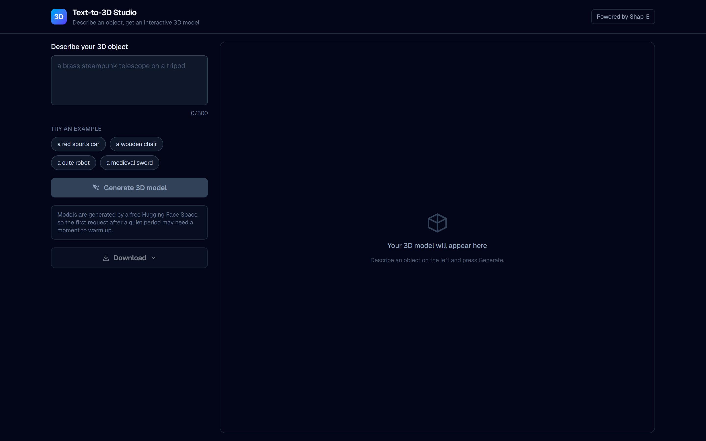
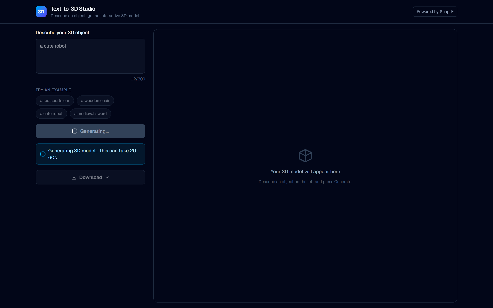
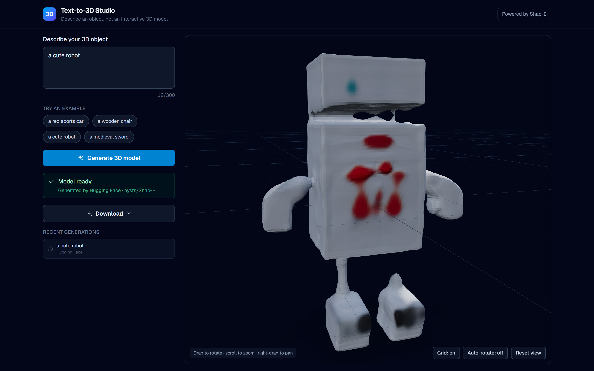
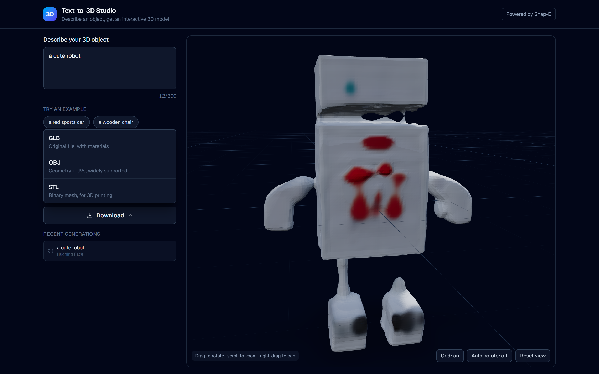
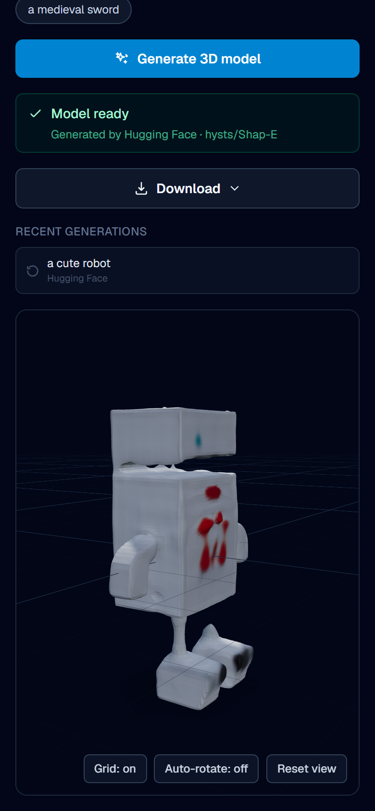
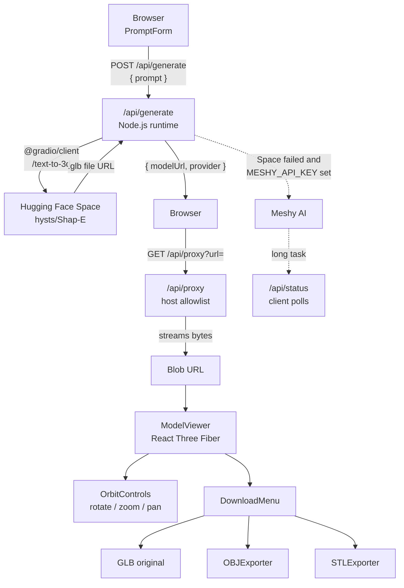

# Text-to-3D Studio

Turn a text prompt into an interactive, downloadable 3D model — powered by the Shap-E text-to-3D model running on Hugging Face Spaces.

**Live demo:** `https://text-to-3d-rho.vercel.app`

---

## Screenshots

| Empty state | Generating |
| --- | --- |
|  |  |

### Model ready



| Download formats | Mobile |
| --- | --- |
|  |  |

---

## Features

- **Text to 3D** — describe an object in plain English and get a real mesh back in roughly 10–30 seconds.
- **Interactive viewer** — drag to rotate, scroll or pinch to zoom, right-drag to pan.
- **Auto-rotate toggle** — turntable spin, on by default.
- **Reset view** — re-frames the camera on the model at any time.
- **Grid toggle** — show or hide the ground reference grid.
- **Download in three formats** — the original GLB, plus OBJ and STL exported in the browser.
- **Generation history** — the last five results, click any one to reload it instantly.
- **Provider attribution** — the UI always shows which backend produced the model.
- **Error handling** — friendly messages for a sleeping Space, a full queue, an exhausted GPU quota, an invalid prompt or a network failure, with technical detail available on demand.
- **Responsive** — a two-column desktop layout that stacks cleanly on phones.

## Tech stack

| Layer | Technology |
| --- | --- |
| Framework | Next.js 16 (App Router, Turbopack) |
| Language | TypeScript (strict) |
| Styling | Tailwind CSS v4 |
| 3D rendering | three.js, @react-three/fiber, @react-three/drei |
| AI client | @gradio/client |
| AI model | Shap-E (`openai/shap-e`) via the `hysts/Shap-E` Space |
| Exporters | three.js `OBJExporter`, `STLExporter` |
| Hosting | Vercel |

## Architecture



### Request flow

1. The user submits a prompt. It is validated on the client and again on the server (non-empty, 300 characters max).
2. `/api/generate` calls the `hysts/Shap-E` Space's `/text-to-3d` endpoint with `seed=0`, `guidance_scale=15`, `num_inference_steps=64`.
3. The Space returns a Gradio `FileData` object whose `url` points at a generated `.glb` on `hysts-shap-e.hf.space`.
4. The route replies with `{ modelUrl, provider, model }`.
5. The browser requests that file through `/api/proxy`, which validates the host and streams the bytes back same-origin.
6. The response becomes a `blob:` URL, which `useGLTF` loads into the React Three Fiber scene.
7. Downloads either reuse the original GLB blob or run a three.js exporter over the loaded scene.

If the Space fails and `MESHY_API_KEY` is configured, the route falls back to Meshy. Because a Meshy job can outlive a single serverless invocation, the route can return a task id instead, which the client polls via `/api/status`.

## API reference

### `POST /api/generate`

Request:

```json
{ "prompt": "a cute robot" }
```

Success:

```json
{
  "modelUrl": "https://hysts-shap-e.hf.space/gradio_api/file=/tmp/gradio/.../model.glb",
  "provider": "huggingface",
  "model": "hysts/Shap-E",
  "pending": false
}
```

Started but still running (Meshy only — poll `/api/status`):

```json
{ "pending": true, "taskId": "018f...", "provider": "meshy", "model": "meshy-preview" }
```

Errors — `400` for an invalid prompt, `502` when every provider failed:

```json
{
  "error": "Could not generate a 3D model right now...",
  "detail": "hysts/Shap-E has exhausted its GPU quota."
}
```

### `GET /api/generate`

Health and configuration check. Reports which Spaces are configured and whether credentials are present, without ever revealing them:

```json
{
  "ok": true,
  "spaces": ["hysts/Shap-E"],
  "hfTokenConfigured": true,
  "meshyConfigured": false
}
```

### `GET /api/proxy?url=<encoded-url>`

Streams a generated model file back to the browser from the same origin. Only `huggingface.co`, `hf.space` and `meshy.ai` (and their subdomains) are permitted.

| Response | Meaning |
| --- | --- |
| `200` | The `.glb` bytes, served as `model/gltf-binary` |
| `400` | Missing `url`, malformed URL, or a non-`https` scheme |
| `403` | Host is not on the allowlist |
| `413` | File exceeds the 100 MB ceiling |
| `502` | Upstream download failed or timed out |

### `GET /api/status?id=<taskId>&provider=meshy`

```json
{ "status": "pending",   "progress": 40 }
{ "status": "succeeded", "modelUrl": "https://assets.meshy.ai/.../model.glb", "progress": 100 }
{ "status": "failed",    "error": "..." }
```

## Project structure

```
text-to-3d/
├── app/
│   ├── api/
│   │   ├── generate/route.ts    # prompt -> provider chain -> { modelUrl }
│   │   ├── proxy/route.ts       # same-origin file streaming + host allowlist
│   │   └── status/route.ts      # polling for long-running provider tasks
│   ├── globals.css              # Tailwind entry + dark theme tokens
│   ├── layout.tsx               # root layout, fonts, metadata
│   └── page.tsx                 # main UI, owns all client state
├── components/
│   ├── DownloadMenu.tsx         # GLB / OBJ / STL downloads
│   ├── ModelViewer.tsx          # R3F canvas, controls, mesh normalisation
│   ├── PromptForm.tsx           # textarea, example chips, submit button
│   └── StatusBar.tsx            # progress, errors, provider attribution
├── lib/
│   ├── providers/
│   │   ├── huggingface.ts       # Gradio client for the Shap-E Space
│   │   └── meshy.ts             # optional paid fallback
│   └── types.ts                 # shared types, validation, host allowlist
├── scripts/
│   └── inspect-space.mjs        # prints a Space's live Gradio API schema
├── docs/
│   ├── ARCHITECTURE.md          # deeper design and security notes
│   └── screenshots/
├── .env.example
└── next.config.ts
```

## Local setup

Requires Node.js 20 or newer.

```bash
# 1. clone
git clone https://github.com/<your-username>/text-to-3d.git
cd text-to-3d

# 2. install
npm install

# 3. configure
cp .env.example .env.local
# then edit .env.local and set HF_TOKEN=hf_...

# 4. run
npm run dev
```

Open <http://localhost:3000>.

| Script | Purpose |
| --- | --- |
| `npm run dev` | Development server |
| `npm run build` | Production build |
| `npm run lint` | ESLint |
| `node scripts/inspect-space.mjs hysts/Shap-E` | Print a Space's live Gradio schema |

### Environment variables

Both are server-side only. Neither uses the `NEXT_PUBLIC_` prefix, so neither is ever included in the client bundle.

| Variable | Required | Purpose |
| --- | --- | --- |
| `HF_TOKEN` | Strongly recommended | Hugging Face access token ([create one](https://huggingface.co/settings/tokens); "Read" scope is enough). |
| `MESHY_API_KEY` | Optional | Enables the Meshy fallback. Leave unset to disable it. |

> **Why `HF_TOKEN` matters.** The app runs without it, since `hysts/Shap-E` is a public Space. But that Space runs on ZeroGPU, where anonymous callers share a small quota per IP address — after about a dozen generations the API starts returning *"hysts/Shap-E has exhausted its GPU quota"*. A token gives you your own quota, so treat it as required for anything beyond a brief demo.

## Deployment on Vercel

1. Push the repository to GitHub.
2. In Vercel, choose **Add New → Project** and import it. Next.js is detected automatically; no build settings need changing.
3. Under **Settings → Environment Variables**, add `HF_TOKEN` (and `MESHY_API_KEY` if you have one) for Production, Preview and Development.
4. Click **Deploy**, then put the resulting URL in the **Live demo** line at the top of this file.

Notes:

- `/api/generate` and `/api/proxy` declare `maxDuration = 60`, which the Node.js runtime supports on Vercel's Hobby plan. The handler budgets itself to 55 seconds so it always returns JSON rather than being terminated mid-request.
- Environment variable changes require a redeploy to take effect.
- Nothing is written to disk and no database is required.

## Design decisions

**Why a proxy route.** Hugging Face Space file URLs send no `Access-Control-Allow-Origin` header, so the browser cannot fetch them directly from the app's origin. `/api/proxy` re-serves the bytes same-origin. It also keeps `HF_TOKEN` server-side when fetching from gated Spaces.

**Why a host allowlist.** A route that fetches any URL a client supplies is a server-side request forgery primitive — it could be pointed at internal addresses. `/api/proxy` therefore accepts only `huggingface.co`, `hf.space` and `meshy.ai`, matching either the exact host or a true subdomain, so a lookalike such as `hf.space.example.com` is rejected. Non-`https` schemes are refused outright.

**Timeouts and retry.** Serverless functions are hard-capped, so every outbound call is raced against an explicit timeout and the handler reserves time to answer before the platform kills it. Connecting to a ZeroGPU Space intermittently fails with a bare `fetch failed` that succeeds on an immediate retry, so each Space gets two attempts — but only for network-level faults, since a full queue or exhausted quota will not clear in a few seconds.

**Why Shap-E.** It is the only text-to-3D model with a reliably running, free, public Gradio Space that exposes a documented `/text-to-3d` endpoint. The provider list in `lib/providers/huggingface.ts` is ordered and additive: verify a new Space with `scripts/inspect-space.mjs`, add it to the array, and it becomes the next fallback automatically.

**Normalising Shap-E meshes.** The generated GLB has no vertex normals and uses a `MeshStandardMaterial` with `metalness: 1` and `roughness: 1`. Rendered as-is in a standard PBR scene the result is a black silhouette: a fully metallic surface has no diffuse response, and without normals there is no surface orientation to light. `prepareScene()` in `ModelViewer.tsx` computes vertex normals and relaxes the material to `metalness: 0.05, roughness: 0.75`. The fix is applied only to untextured, vertex-coloured meshes, so a properly authored model from another provider keeps its intended appearance.

**Self-contained lighting.** drei's `<Stage environment="...">` presets stream an HDR environment map from a third-party CDN. On any network that blocks it, every model would render unlit. The viewer passes `environment={null}` and supplies its own hemisphere and directional lights instead.

**Stale-response guarding.** Each generation is tagged with an incrementing run id, and any asynchronous step that completes after a newer run has begun is discarded. Rapidly re-submitting cannot leave the viewer showing a model from an abandoned request.

## Limitations

- **Model quality.** Shap-E is a 2023 model. Results are coarse and low-resolution, with vertex colours rather than textures. It handles simple, chunky objects well and struggles with fine detail, thin structures and text.
- **GPU quota.** Without `HF_TOKEN`, only a handful of generations are available per IP address.
- **Single free provider.** No second free text-to-3D Space is currently reachable, so if Shap-E is unavailable the app needs `MESHY_API_KEY` to produce anything.
- **History is in-memory.** The last five generations live in React state and are lost on refresh. The Space also deletes its temporary files after a while, so an older history entry can fail to reload.
- **OBJ and STL lose colour.** Neither format carries the vertex colours Shap-E relies on; only the GLB download preserves full appearance.
- **60-second ceiling.** A single serverless invocation cannot run longer, which is why the `/api/status` polling path exists.
- **No rate limiting.** A public deployment has nothing preventing a visitor from consuming the quota.

## Future improvements

- Rate limiting by IP before any public launch.
- Persist history to `localStorage` and re-host finished models in blob storage so old entries keep working.
- Expose `seed`, `guidance_scale` and `num_inference_steps` as advanced controls.
- Adopt a stronger model such as TRELLIS or Hunyuan3D behind the same provider interface once a reliably running Space is available.
- Bake vertex colours into a texture so OBJ and STL exports keep their colour.
- Turntable GIF and screenshot capture directly from the canvas.

## Author

**Priyanshi Paul** — [ppriyanshi1177@gmail.com](mailto:ppriyanshi1177@gmail.com)
