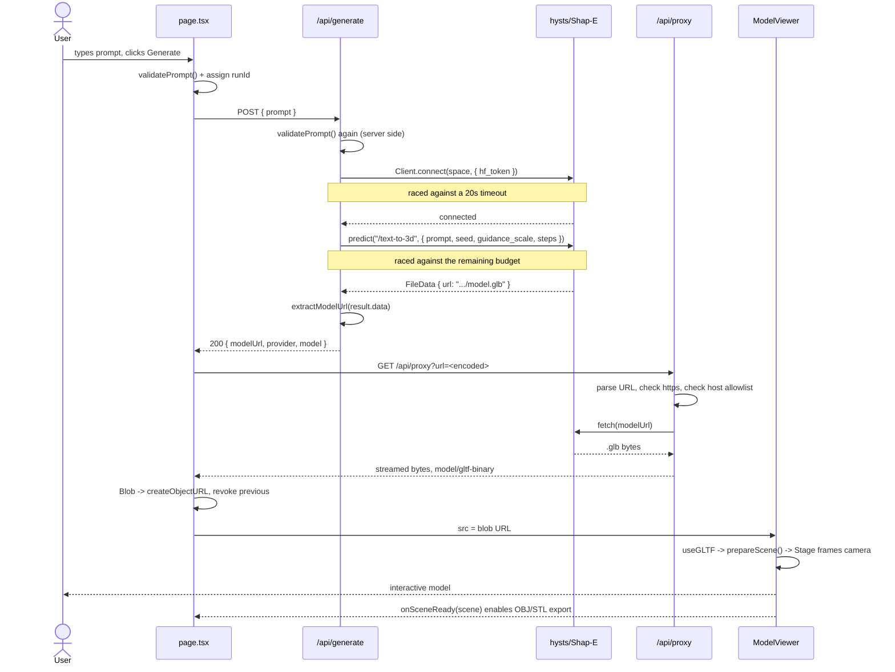

# Architecture

A deeper look at how Text-to-3D Studio is put together, why the boundaries sit where they do, and how failures are handled. For setup and usage, see the [README](../README.md).

## Contents

- [System overview](#system-overview)
- [Lifecycle of one generation](#lifecycle-of-one-generation)
- [Component breakdown](#component-breakdown)
- [Provider abstraction](#provider-abstraction)
- [Rendering pipeline](#rendering-pipeline)
- [Security](#security)
- [Error handling](#error-handling)
- [Performance and resource management](#performance-and-resource-management)

## System overview

The application is a single Next.js deployment with no database and no persistent storage. All state is either in React memory or held by the upstream provider.

There are three trust zones:

| Zone | Contains | Trust |
| --- | --- | --- |
| Browser | UI, viewer, exporters, history | Untrusted — all input re-validated server-side |
| Next.js server | API routes, provider modules, credentials | Trusted — the only place secrets exist |
| Upstream providers | Hugging Face Space, Meshy | External — may be slow, asleep, rate-limited or down |

The server exists for exactly three reasons: to hold credentials, to reach providers the browser cannot reach directly because of CORS, and to validate input.

## Lifecycle of one generation



### Failure branch

If the Space throws, `generateWithHuggingFace` classifies the error. Network-level faults get one immediate retry; everything else moves to the next provider. If Meshy is configured it starts a task and polls inside the remaining budget. If the budget runs out while the task is still running, the route returns `{ pending: true, taskId }` and the client takes over polling `/api/status`, which lets a generation outlive the 60-second function ceiling. If every provider fails, the route returns `502` with a human-readable `error` plus a `detail` string naming what each provider did.

## Component breakdown

### Server

| Module | Responsibility |
| --- | --- |
| `app/api/generate/route.ts` | Validates the prompt, walks the provider chain inside a 55-second self-imposed budget, shapes the JSON response. Also serves a `GET` health view. |
| `app/api/proxy/route.ts` | Validates and allowlists the target host, then streams the model file back same-origin. Attaches `HF_TOKEN` for gated Space files. |
| `app/api/status/route.ts` | Reports the state of a long-running provider task. Meshy only; rejects other providers. |
| `lib/providers/huggingface.ts` | Gradio client, per-Space config, timeout racing, retry policy, model-URL extraction, error classification. |
| `lib/providers/meshy.ts` | Task creation, status polling, budget-aware wait loop. |
| `lib/types.ts` | Types shared by client and server, prompt validation, host allowlist, filename slug. |

Validation and the allowlist live in `lib/types.ts` specifically so the client and server cannot drift apart on the rules.

### Client

| Component | Responsibility |
| --- | --- |
| `app/page.tsx` | Owns all state: prompt, phase, blob URL, provider, history, loaded scene. Orchestrates generate → poll → proxy → display. |
| `components/PromptForm.tsx` | Textarea with a live counter, example chips, Enter-to-submit, disabled during generation. |
| `components/ModelViewer.tsx` | React Three Fiber canvas, lighting, camera framing, orbit controls, mesh normalisation, progress overlay. |
| `components/DownloadMenu.tsx` | GLB passthrough plus lazily imported OBJ and STL exporters. |
| `components/StatusBar.tsx` | Renders the current phase: idle hint, progress, success with provider attribution, or an error with collapsible detail. |

State deliberately lives in one place. The viewer reports its loaded scene upward via `onSceneReady` so the download menu can export it, rather than each component fetching independently.

## Provider abstraction

Both providers return the same union:

```ts
type ProviderResult =
  | { kind: "model"; modelUrl: string; model: string }
  | { kind: "task";  taskId: string;  model: string };
```

`kind: "task"` is what makes the polling path possible without special-casing the route. Adding a provider means writing a module that returns this type and adding it to the chain in `/api/generate`.

Adding another Hugging Face Space is cheaper still — `SPACES` in `lib/providers/huggingface.ts` is an ordered array:

```ts
{ id, endpoint, build: (prompt) => ({ /* named Gradio params */ }) }
```

Endpoint and parameter names must come from the Space's live schema, which `node scripts/inspect-space.mjs <owner/space>` prints. Gradio endpoint names and argument order vary between Spaces and change without notice, so they should never be assumed.

`extractModelUrl` walks the returned payload breadth-first rather than reading `data[0].url`, because sibling Spaces wrap the file in an array or nest it a level deeper. It also handles the case where Gradio returns a bare server `path` instead of a URL, rebuilding it as `https://<space>.hf.space/gradio_api/file=<path>`.

## Rendering pipeline

1. **Fetch** — the blob arrives from `/api/proxy` already same-origin.
2. **Parse** — `useGLTF` (drei's wrapper over `GLTFLoader`) suspends until the mesh is ready.
3. **Clone** — the cached scene is cloned so repeated mounts never reparent or re-edit the original.
4. **Normalise** — `prepareScene()` fixes the two properties that make a raw Shap-E mesh unrenderable:
   - **Missing vertex normals.** `MeshStandardMaterial` has no surface orientation to light without them, so the mesh shades black. `computeVertexNormals()` fills them in.
   - **`metalness: 1, roughness: 1`.** A fully metallic surface has no diffuse response and reflects only a heavily blurred environment, which is near black against a dark background. Relaxed to `metalness: 0.05, roughness: 0.75`.

   Both corrections are gated on the mesh being untextured and vertex-coloured, so a well-authored model from another provider is left untouched.
5. **Frame** — `<Stage>` centres the model and fits the camera. Its `key` combines the source URL and a reset counter, so a new model re-frames on mount and "Reset view" re-frames on demand, without an effect that would cascade an extra render.
6. **Light** — hemisphere plus two directional lights, defined in the scene. `environment` is explicitly `null` to avoid a runtime dependency on a third-party HDR CDN.
7. **Export** — the loaded scene is passed up to `DownloadMenu`, which imports `OBJExporter` or `STLExporter` dynamically so neither is in the initial bundle.

## Security

**Credentials never reach the browser.** `HF_TOKEN` and `MESHY_API_KEY` are read only inside route handlers and provider modules. Neither carries the `NEXT_PUBLIC_` prefix, so Next.js will not inline them into client code. `GET /api/generate` reports whether a credential is configured as a boolean, never its value.

**SSRF protection on the proxy.** `/api/proxy` takes a URL from the client, which without constraints would let anyone use the deployment to fetch arbitrary addresses, including cloud metadata endpoints and internal services. Three checks apply before any request is made:

1. The URL must parse.
2. The scheme must be `https`.
3. The hostname must equal an allowlisted host or be a true subdomain of one.

The subdomain check is written as `host === allowed || host.endsWith("." + allowed)`. A plain substring or `endsWith` test on the bare domain would wrongly accept `hf.space.attacker.com`; this form rejects it.

**Input validation on both sides.** `validatePrompt` runs in the browser for immediate feedback and again in the route handler, which is the boundary that actually counts. It enforces a non-empty, trimmed, 300-character maximum and rejects non-string input. Malformed JSON bodies produce a `400` rather than an unhandled exception.

**Response size ceiling.** The proxy refuses anything advertising more than 100 MB, so a hostile or broken upstream cannot stream unbounded data through the function.

**Download filenames are sanitised.** `slugify()` reduces a prompt to `[a-z0-9-]` before it is used in a `download` attribute, so a prompt cannot inject path separators or quotes into the filename.

**No persistence.** There is no database, no session, no user data at rest, and nothing written to disk.

### Residual risks

| Risk | Status |
| --- | --- |
| No rate limiting | Open. A public deployment can have its GPU quota consumed by anyone. Add an IP-keyed limiter before launch. |
| Prompt content is unfiltered | Accepted. Prompts go to a third-party Space governed by its own policies. |
| Proxy is an open relay for allowlisted hosts | Accepted. Limited to three providers that already serve these files publicly. |

## Error handling

Provider errors are classified in `describeSpaceError` and translated into messages that tell the user something actionable, instead of surfacing a raw stack trace.

| Condition | Detection | User sees | HTTP |
| --- | --- | --- | --- |
| Empty or whitespace prompt | `validatePrompt` | "Please describe the object you want to generate." | 400 |
| Prompt over 300 characters | `validatePrompt` | "Prompt is too long (N/300 characters)." | 400 |
| Body is not JSON | `request.json()` throws | "Request body must be JSON." | 400 |
| Space asleep or paused | `/sleep|paused|503|not running/` | "… is asleep or paused." | 502 |
| Queue full | `/queue\|full/` | "… has a full queue right now." | 502 |
| GPU quota exhausted | `/gpu\|quota\|exceeded/` | "… has exhausted its GPU quota." | 502 |
| Bad or missing token | `/401\|403\|token\|authoriz/` | "… rejected the credentials (check HF_TOKEN)." | 502 |
| Connect or predict timeout | timeout race | "… did not respond in time (it may be waking up or busy)." | 502 |
| Transient network fault | `/fetch failed\|ECONNRESET\|…/` | Retried once, then reported | 502 |
| Space returned no file | `extractModelUrl` returns null | "the Space returned no model file" | 502 |
| Proxy: missing or bad URL | URL parse | "Missing `url` query parameter." / "`url` is not a valid URL." | 400 |
| Proxy: disallowed host | allowlist | "Host \"…\" is not allowed." | 403 |
| Proxy: file too large | `content-length` | "The model file is too large to proxy." | 413 |
| Proxy: upstream failure | non-OK response | "Upstream returned HTTP N for the model file." | 502 |
| History entry expired | proxy returns non-OK | Error noting the provider may have deleted the file | — |

The client shows the friendly `error` string and tucks the provider-level `detail` behind a "Technical details" disclosure, so the interface stays calm while the information needed to diagnose a problem remains one click away.

## Performance and resource management

**Time budgeting.** `/api/generate` sets a 55-second internal budget against a 60-second platform limit. The budget is passed down and decremented, so each provider knows how long it may take and the handler always has time to serialise a response.

**Blob URL lifecycle.** Every generation creates one object URL. The previous one is revoked when it is replaced, and the last is revoked on unmount. `useGLTF.clear(src)` runs on unmount as well, since each generation has a unique URL and drei's cache would otherwise retain every mesh for the lifetime of the tab.

**Race protection.** A monotonically increasing `runId` guards every asynchronous continuation. A response from a superseded request is dropped rather than applied, so the viewer, status bar and history always reflect the most recent submission.

**Bundle size.** The viewer is loaded via `next/dynamic` with `ssr: false`, because three.js touches `window` at module scope. The OBJ and STL exporters are imported only when the user actually picks that format.

**Caching.** `/api/proxy` sets `Cache-Control: public, max-age=3600`, which is safe because provider file URLs are content-addressed and immutable. Generation and status responses are explicitly `no-store`.
